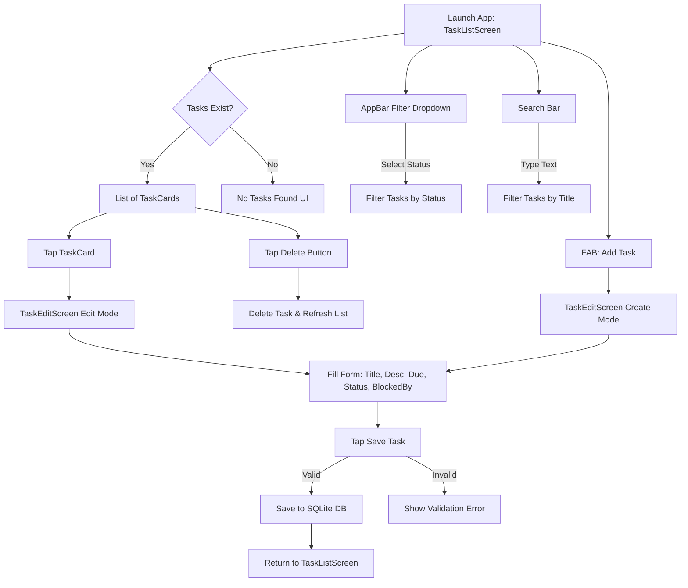

# Application Flowchart

Here is the flowchart representing the task management application's functionality. The code analysis confirmed that all buttons (filters, search, add task, edit task, delete, date pickers, drop downs) are fully wired up in the code.

